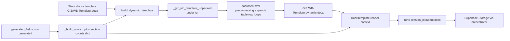

# Renderer context: dynamic Word template → `output.docx`

This note describes **how CV renderers produce the final `.docx`**, focusing on **where the run-scoped “dynamic” template is built on disk**, how it differs from the static donor template, and how that feed becomes `output.docx` before orchestrator upload.

Canonical entrypoints: [`templates/giz.py`](templates/giz.py), [`templates/wb.py`](templates/wb.py), [`templates/registry.py`](templates/registry.py) (`get_renderer` only matters for Phase 4), [`pipeline/paths.py`](pipeline/paths.py), [`templates/giz_dynamic_template.py`](templates/giz_dynamic_template.py), [`templates/wb_dynamic_template.py`](templates/wb_dynamic_template.py).

---

## When the renderer runs

- **Phase:** Phase 4, after HTTP approval of **`checkpoint_3`** (see [`pipeline/orchestrator.py`](pipeline/orchestrator.py) `run_phase4`).
- **Dispatch:** `get_renderer(session["target_format"])(session_id)` resolves to `templates.giz.run` or `templates.wb.run`.
- **Inputs:** Reads **`runs/{session_id}/generated_fields.json`** → canonical CV snapshot is **`["generated"]`** (post Agent 6). No LLM in the renderer; **docxtpl** fills Jinja placeholders.

---

## Data flow (high level)



---

## On-disk locations (paths)

All run artifacts live under **`RUNS_ROOT`** = project-root **`runs/`** ([`pipeline/paths.py`](pipeline/paths.py)).

| Asset | Path pattern | Role |
|--------|----------------|------|
| Run workspace | `runs/{session_id}/` | Session-scoped artifacts |
| Frozen donor template | `templates/GIZ-Template.docx` or `templates/WB-Template.docx` | Source **before** XML surgery |
| Unpack scratch dir | `runs/{session_id}/_giz_template_unpacked/` or `.../_wb_template_unpacked/` | Extracted OOXML bundle; **`word/document.xml` is rewritten** |
| Dynamic template (**stored before final output**) | `runs/{session_id}/GIZ-Template.dynamic.docx` or `.../WB-Template.dynamic.docx` | **Repacked .docx** with loop/table structure expanded for this run’s counts |
| Final rendered file | `runs/{session_id}/output.docx` | **DocxTemplate.render** writes here; Phase 4 then uploads |

Path helpers (same file): `get_run_dir`, `get_giz_dynamic_template_path`, `get_giz_dynamic_unpack_dir`, and WB equivalents.

---

## Why a “dynamic” template exists

Standard Word tables have a **fixed number of rows**. The pipelines need **variable-length** sections (education, languages, projects, …). **`docxtpl`** can loop bullets in some places, but table rows often need **``**-style placeholders that expand to **explicit row XML** matched to **`counts`**.

So the renderer:

1. **Unpacks** the static `.docx` (ZIP) into the run-specific unpack folder.
2. **Rewrites** `word/document.xml` in UTF‑8 (`preprocess_document_xml` in [`giz_dynamic_template.py`](templates/giz_dynamic_template.py) / WB variant) using **`counts`** (lengths derived from `_build_context(cv_data)`).
3. **Re-zips** the tree into **`GIZ-Template.dynamic.docx` / `WB-Template.dynamic.docx`** under **`runs/{session_id}/`**.

That file is **the persisted dynamic template artifact** consumed by **`DocxTemplate(str(dynamic_template_path))`**—not the immutable file under **`templates/`**.

**Idempotency / cleanup:** Before each build, if the unpack directory exists it is **`shutil.rmtree`**’d, then recreated. If `*.dynamic.docx` exists it is **`unlink`**’d before writing the new ZIP.

---

## Counts dictionaries (format-specific)

`templates/giz.run` builds `counts` with keys aligned to the GIZ preprocessor (education, languages, countries_of_experience, relevant_projects, key_qualifications, publications).

`templates/wb.run` uses `employment_record` instead of countries / key qualifications as appropriate for WB.

These counts drive **how many table rows / indexed placeholders** appear in **`document.xml`**, not JSON field names literally.

---

## Final render step

After `build_dynamic_template(...)` succeeds:

```text
DocxTemplate(dynamic_template_path) → render(context from _build_context) → save(output.docx)
```

- **`context`** maps `CVData` (dict shape) plus derived display fields (`nationality_display`, formatted lists, …) to template variables.
- **Output:** `runs/{session_id}/output.docx`.

Phase 4 in the orchestrator then **reads bytes** from that path, **uploads** to Supabase Storage under a keyed path (e.g. `round_NN_{target_format}.docx`), updates **`output_storage_key`**, sets session **`completed`**.

---

## Failure surfaces

Typical failures: missing run dir or `generated_fields.json`, missing **`generated`** payload, missing static template on disk, `build_dynamic_template` errors (corrupt/absent `document.xml`, preprocess mismatch), docxtpl render errors.

---

## Related docs

- End-to-end pipeline: [`PIPELINE_CONTEXT.md`](PIPELINE_CONTEXT.md)
- Planned compression/registry changes: [`migration_plan.md`](migration_plan.md), [`MIGRATION_IMPLEMENTATION_PLAN.md`](MIGRATION_IMPLEMENTATION_PLAN.md)
