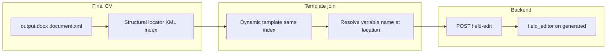
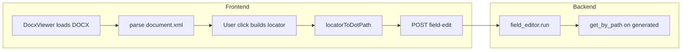

# Field-edit locator issues and amendments

This note explains why post-completion **field edits** sometimes return **`skipped`** with **`path resolution failed`**, how click-to-path mapping works today, and **prioritized amendments** (documentation only; code changes are separate tasks).

**Related**

- [REFERENCING_SYSTEM_CURRENT_PIPELINE.md](REFERENCING_SYSTEM_CURRENT_PIPELINE.md) — live pipeline, `/field-edit`, key files
- [REFERENCING_SYSTEM_MIGRATION_CHECKLIST.md](REFERENCING_SYSTEM_MIGRATION_CHECKLIST.md) — FE/BE alignment and WB mapping work

**Foundation for structural referencing**

- [`cv-drafter-ui/docx-viewer.html`](../../cv-drafter-ui/docx-viewer.html) — original **DOCX structural locator** tool: parses `word/document.xml` in `w:body` order, assigns **paragraph** indices and **table / row / cell** indices, and exposes the same JSON locator shape (`location`, `paragraph_index` or `table_index` / `row_index` / `cell_index`, `text_content`) used by the React viewer. It does **not** resolve template variable names; it only defines **how** XML position is recorded.

---

## Intended pipeline (template join — compliance target)

Amendments below are written so the product **converges** on this model, which extends the `docx-viewer.html` idea instead of replacing structural indices with ad hoc string paths.

1. **Structural index from the final generated CV**  
   User opens **`output.docx`** (the rendered CV). The viewer parses `word/document.xml` exactly in **document body order**, as in `docx-viewer.html` / [`DocxViewer.tsx`](../../cv-drafter-ui/src/components/DocxViewer.tsx): each click yields a **structural locator** (XML index: paragraph index, or table + row + cell indices).

2. **Same index in the dynamic template**  
   The pipeline builds the CV from a **dynamic template** (e.g. [`giz_dynamic_template.py`](../templates/giz_dynamic_template.py) / [`wb_dynamic_template.py`](../templates/wb_dynamic_template.py)) that expands placeholders into the same document structure. For the **same** structural index (same position in the parallel `document.xml` shape produced by that template pass), resolve the **variable name** (the field binding / placeholder identity at that location — i.e. the canonical name that maps to a path under `generated_fields["generated"]`).

3. **API → field editor**  
   That resolved **variable name** (as `field_path` relative to `generated`, or an agreed normalised form) is sent with the user’s **instruction** via **`POST /sessions/{id}/field-edit`** to the **field editor** agent, which edits the stored value at that path in `generated_fields.json`.

**Gap today:** [`locatorToDotPath.ts`](../../cv-drafter-ui/src/lib/utils/locatorToDotPath.ts) **skips** step 2 and guesses dot paths from format + table geometry (and paragraph regexes), producing placeholders like `paragraph_21` that are **not** template variable names. That violates the intended join and causes backend `path resolution failed`.

---

## Executive summary

The UI derives **structural XML indices** from `word/document.xml` in the same way as [`docx-viewer.html`](../../cv-drafter-ui/docx-viewer.html) (see **Intended pipeline**). It then maps those indices to `field_path` mostly via **heuristics** in [`locatorToDotPath.ts`](../../cv-drafter-ui/src/lib/utils/locatorToDotPath.ts) instead of joining the **dynamic template** at the same index to obtain the real variable name. That produces synthetic paths (for example `paragraph_21`) that are **not** keys under `generated_fields["generated"]`. The backend field editor resolves paths only inside that object; unresolved paths are returned as **`skipped`** with **`path resolution failed: '<path>'`**. This is a contract mismatch between the **intended** template-join pipeline and the **current** shortcut, not a random API failure.

---

## What goes wrong

### Synthetic `field_path` values

In [`cv-drafter-ui/src/lib/utils/locatorToDotPath.ts`](../../cv-drafter-ui/src/lib/utils/locatorToDotPath.ts):

- **Paragraphs** that do not match a small “key qualification” regex get  
  `dotPath: paragraph_<paragraph_index>` with `confidence: "fallback"`.
- **Unknown table cells** get  
  `dotPath: table_<t>_row_<r>_cell_<c>` with `confidence: "fallback"`.

Neither string is a normal field on the **`generated`** subtree unless coincidentally present (they are not part of the schema by design).

### Weak `key_qualifications[...]` heuristic

When the regex matches, the mapper emits `key_qualifications[<paragraph_index>]`. Here **`paragraph_index`** is the **global** zero-based index of top-level `w:p` elements in `w:body`, not the index of an item inside the `key_qualifications` array. Cover text, headings, and bullets share that counter, so the path is often **wrong** even when it resolves (wrong bullet) or **out of range** (skip / error depending on array length).

### Backend contract (authoritative)

[`cv-drafter/pipeline/agents/field_editor.py`](../pipeline/agents/field_editor.py) documents that each edit uses `field_path` **relative to `generated_fields["generated"]`**. Resolution uses `_normalise_path` / `get_by_path` on that object. Paths that do not exist there fail with **`path resolution failed`**.

---

## How mapping works today (actual data flow)

This is the **current** implementation; compare to **Intended pipeline** above — step “template join” is missing and replaced by heuristics.

| Step | Location | Role |
|------|-----------|------|
| Parse | [`DocxViewer.tsx`](../../cv-drafter-ui/src/components/DocxViewer.tsx), same body-order rules as [`docx-viewer.html`](../../cv-drafter-ui/docx-viewer.html) | JSZip + `word/document.xml` → ordered paragraphs and tables with indices |
| Locator | Same | `{ location, paragraph_index \| table_index, row_index, cell_index, text_content }` — **aligned with docx-viewer.html** |
| Map | [`locatorToDotPath.ts`](../../cv-drafter-ui/src/lib/utils/locatorToDotPath.ts) | **Should** become: join locator + dynamic template → variable name; **today:** donor-specific guesses / fallbacks without template lookup |
| Confirm | [`FieldSelectorTooltip.tsx`](../../cv-drafter-ui/src/components/FieldSelectorTooltip.tsx) | Composites and instruction entry |
| Submit | [`SessionWorkspacePage.tsx`](../../cv-drafter-ui/src/pages/SessionWorkspacePage.tsx), [`api.ts`](../../cv-drafter-ui/src/lib/api.ts) | `{ field_path, instruction }[]` |
| Apply | [`field_editor.py`](../pipeline/agents/field_editor.py), [`sessions.py` router](../api/routers/sessions.py) | Resolve path under `generated`, apply or skip |

**Parser limits (structural):** body-only `w:p` / `w:tbl`; merged cells not modelled; text flattened from `w:t`. Same constraints apply to [`docx-viewer.html`](../../cv-drafter-ui/docx-viewer.html). Until template join exists, there is no authoritative link from index → `generated` field except where heuristics accidentally match the template.

---

## Amendments (prioritized)

### P0 — Block invalid submissions (UI)

**Goal:** Never send placeholder `field_path` values to the API; **block** submit and show a **clear, user-visible message** (toast, inline alert, or modal — product choice).

**When to block**

- Before `POST /field-edit`, if any edit’s path is a known non-schema placeholder produced when template join is missing, in particular:
  - `field_path` matching `^paragraph_\d+$`, or
  - `field_path` matching `^table_\d+_row_\d+_cell_\d+$`,  
  or equivalently: `confidence === "fallback"` **and** the path is one of these patterns (the same rows [`locatorToDotPath.ts`](../../cv-drafter-ui/src/lib/utils/locatorToDotPath.ts) emits when it cannot resolve a real `generated` field).

**Message content (minimum clarity)**

- Explain that this location **could not be linked** to a CV field because the app is not yet using **template variable resolution** at the clicked XML index (see **Intended pipeline** and [`docx-viewer.html`](../../cv-drafter-ui/docx-viewer.html) foundation).
- Tell the user to **use a mapped table cell** where the field is known, or wait for the template-join implementation — **do not** allow submit in this state.

**Touchpoints:** submit handler in [`SessionWorkspacePage.tsx`](../../cv-drafter-ui/src/pages/SessionWorkspacePage.tsx); optionally reinforce in [`DocxViewer.tsx`](../../cv-drafter-ui/src/components/DocxViewer.tsx) by marking fallback edits as non-submittable in the list UI.

**Acceptance:** Submitting `paragraph_N` or `table_*_*_*` placeholders returns **no** network request; user always sees an explicit error message describing why.

### P1 — Narrow edit surface

**Goal:** Reduce bad paths until template join (or P4 metadata) exists.

- Field-editor mode: allow clicks only on **mapped** table cells (`confidence === "mapped"`), or disable paragraph clicks until **Intended pipeline** resolution exists for paragraphs.

**Acceptance:** Fewer `skipped` responses from impossible paths at the cost of less coverage until P2/P4.

### P2 — Paragraph mapping (template join, not regex)

**Goal:** Align with **Intended pipeline**: for a paragraph **XML index** from `output.docx`, resolve the **variable name** at the **same index** in the dynamic template’s logical structure — not `key_qualifications[paragraph_index]` from a regex on visible text.

- Remove or retire the global-paragraph-index heuristic once template join supplies the correct path.

**Acceptance:** Every submitted paragraph edit’s `field_path` comes from template resolution at the shared XML index, or paragraph clicks remain disabled until that exists.

### P3 — Structural / WB (and GIZ) alignment

**Goal:** Table **indices** from the final CV (per `docx-viewer.html` rules) must match the **same** positions in the template’s expanded layout so template join returns the correct variable. Until then, keep [`locatorToDotPath.ts`](../../cv-drafter-ui/src/lib/utils/locatorToDotPath.ts) manually aligned with [`wb_dynamic_template.py`](../templates/wb_dynamic_template.py) and [`giz_dynamic_template.py`](../templates/giz_dynamic_template.py); follow [REFERENCING_SYSTEM_MIGRATION_CHECKLIST.md](REFERENCING_SYSTEM_MIGRATION_CHECKLIST.md) (employment, composite projects, `tasks_assigned` / `detailed_tasks`).

**Acceptance:** Higher apply rate and fewer `skipped` due to index/geometry drift between viewer and template.

### P4 — Longer-term: explicit template metadata (sidecar or OOXML)

**Goal:** Same outcome as full **template join**, with less runtime coupling: at render time emit a **map** from structural index (or stable content-control id) → `field_path` / variable name, consumed by the viewer so the flow matches **Intended pipeline** without fragile heuristics.

- Options: JSON sidecar shipped with `output.docx`, or custom OOXML tags written by the renderer — either way, the viewer uses **the same index model** as [`docx-viewer.html`](../../cv-drafter-ui/docx-viewer.html) to look up the row in that map.

**Acceptance:** Paragraph and composite regions resolve to authoritative paths the field editor can load.

---

## Verification (for this document)

- This file lives at `cv-drafter/markdowns/FIELD_EDIT_LOCATOR_ISSUES_AND_AMENDMENTS.md`.
- Links to sibling `cv-drafter-ui` use `../../cv-drafter-ui/...`; links inside `cv-drafter` use `../...` from this directory.
- Structural locator rules should stay consistent with [`docx-viewer.html`](../../cv-drafter-ui/docx-viewer.html) and [`DocxViewer.tsx`](../../cv-drafter-ui/src/components/DocxViewer.tsx) so **XML index** in the final CV and template join step refer to the same coordinate system.

---

*Amendments P0–P4 describe intended follow-up work; implementing them requires separate PRs. P0 must **block** submit with a clear message (no silent or optional bypass). Full **template join** (index in `output.docx` → same index in dynamic template → variable name → `field_path`) aligns the React app with the [`docx-viewer.html`](../../cv-drafter-ui/docx-viewer.html) foundation.*
