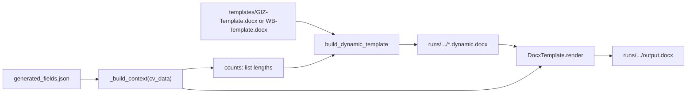

# Renderer context: dynamic Word template → `output.docx`

How **GIZ** and **World Bank** renderers produce **`runs/{session_id}/output.docx`** for [`run_phase4`](pipeline/orchestrator.py): run-scoped OOXML preprocessing, then **`docxtpl`**. No LLM calls in `templates/giz.py` or `templates/wb.py`.

Canonical code: [`templates/giz.py`](templates/giz.py), [`templates/wb.py`](templates/wb.py), [`templates/registry.py`](templates/registry.py), [`pipeline/paths.py`](pipeline/paths.py), [`templates/giz_dynamic_template.py`](templates/giz_dynamic_template.py), [`templates/wb_dynamic_template.py`](templates/wb_dynamic_template.py).

---

## When rendering runs

1. **Trigger**: HTTP **`POST /sessions/{session_id}/approve/checkpoint_3`** adds background task [`run_phase4`](pipeline/orchestrator.py).
   - For post-completion revisions, the same `run_phase4` path re-runs after `POST /field-edit` → `POST /approve/checkpoint_3`; the incremented `sessions.round` value is used to label the new output file (e.g. `round_02_giz.docx`).
2. **Orchestrator** ([`run_phase4`](pipeline/orchestrator.py)):
   - Calls **`set_processing(session_id)`** first (DB status **`processing`**).
   - If **`get_step_status(run_dir, "renderer") == "done"`**: logs a warning and **returns**. It does **not** call **`set_done`**, **`update_session_storage_keys`**, or **`set_failed`**. DB stays **`processing`** until something else changes it (operators) or [**`reset_stale_processing_sessions`**](api/services/database.py) on app startup marks mid-flight rows **`failed`**.
   - Else: **`update_step(run_dir, "renderer", "running")`**, reads **`target_format`** from **`get_session_row`**, **`output_path = get_renderer(target_format)(session_id)`**, **`update_step(..., "done")`**, **`upload_bytes`**, **`update_session_storage_keys(..., output_storage_key=output_key)`**, **`set_done(session_id, output_key)`** ( **`status=completed`**, **`output_file_path`** set to that storage key).
3. **Registry** ([`get_renderer`](templates/registry.py)): **`(target_format or "giz").strip().lower().replace(" ", "_")`** → **`giz`** → **`templates.giz.run`**; **`world_bank`** → **`templates.wb.run`**; anything else raises **`ValueError`**.
4. **Inputs**: **`runs/{session_id}/generated_fields.json`**, required key **`"generated"`** ( **`CVData`**-shaped dict). The JSON route **`GET /sessions/{id}/output`** returns overlapping fields from this file; **the `.docx`** is only from Storage / signed download, not that endpoint.

---

## Data flow (pipeline inside the renderer)

[`build_dynamic_template`](templates/giz_dynamic_template.py) (WB: [`wb_dynamic_template.py`](templates/wb_dynamic_template.py)) performs all of: extract static `.docx` ZIP → **`unpacked_dir`** → read **`word/document.xml`** → **`clean_jinja_runs`** then **`preprocess_document_xml(xml, counts)`** → write **`document.xml`** → write new ZIP to **`*.dynamic.docx`**. Then **`DocxTemplate(dynamic_path).render(context).save(output_path)`**.

---

## On-disk paths

[`RUNS_ROOT`](pipeline/paths.py) = **`cv-drafter/runs`** (resolved from **`paths.py`** parent hierarchy).

| Asset | Pattern |
|--------|---------|
| Run dir | `runs/{session_id}/` |
| Static templates | `templates/GIZ-Template.docx`, `templates/WB-Template.docx` |
| GIZ unpack | `runs/{session_id}/_giz_template_unpacked/` |
| WB unpack | `runs/{session_id}/_wb_template_unpacked/` |
| GIZ dynamic | `runs/{session_id}/GIZ-Template.dynamic.docx` |
| WB dynamic | `runs/{session_id}/WB-Template.dynamic.docx` |
| Preview output | `runs/{session_id}/preview.docx` (legacy; no longer produced by the normal pipeline; may exist on older sessions) |
| Render output | `runs/{session_id}/output.docx` (Phase 4 final; default, overridable in **`giz.run` / `wb.run`** for tests) |

---

## Dynamic template rationale

Word table row counts are fixed in the source binary. Variable-length sections need enough **`<w:tr>`** rows in **`document.xml`** for **`docxtpl`** to fill. **`preprocess_document_xml`** expands loop markers using the **`counts`** dict (see below). **`clean_jinja_runs`** normalizes split **`w:t`** runs that break Jinja tags.

**Cleanup**: [`build_dynamic_template`](templates/giz_dynamic_template.py) **`rmtree(unpacked_dir)`** if present, **`unlink(out_docx)`** if present, then writes fresh.

---

## `counts` keys

**GIZ** ([`giz.run`](templates/giz.py)) / [`_COUNT_KEYS`](templates/giz_dynamic_template.py): **`education`**, **`languages`**, **`countries_of_experience`**, **`relevant_projects`**, **`key_qualifications`**, **`publications`**.

**WB** ([`wb.run`](templates/wb.py)) / [`_COUNT_KEYS`](templates/wb_dynamic_template.py): **`education`**, **`languages`**, **`employment_record`**, **`relevant_projects`**, **`publications`**.

---

## `_build_context` differences (GIZ vs WB)

Source dict is **`generated_fields["generated"]`** (same file the compressor mutates).

- **GIZ**: CEFR mapping via **`_map_cefr`** for language columns; **`nationality_display`**, **`other_skills_display`**; **`key_qualifications`** from **`cv_data["generated_fields"]`** items with **`field_key == "key_qualifications"`** if any, else **`cv_data["key_qualifications"]`** list; full **`countries_of_experience`** / **`relevant_projects`** row-shaped dicts.
- **WB**: Raw **`reading_raw`** / **`speaking_raw`** / **`writing_raw`**; **`employment_record`** rows with **`positions_held`** → **`position`**; **`detailed_tasks`** from **`generated_fields`** entries **`field_key == "detailed_tasks"`** aligned by index to **`relevant_projects`** as **`tasks_assigned`**.

---

## Failure modes

Renderer surfaces: missing **`run_dir`**, missing or invalid **`generated_fields.json`**, empty **`generated`**, missing static template file, missing **`word/document.xml`** in unpack, preprocess exceptions, **`docxtpl`** render mismatch.

---

## Related

- Full pipeline: [`PIPELINE_CONTEXT.md`](PIPELINE_CONTEXT.md)
